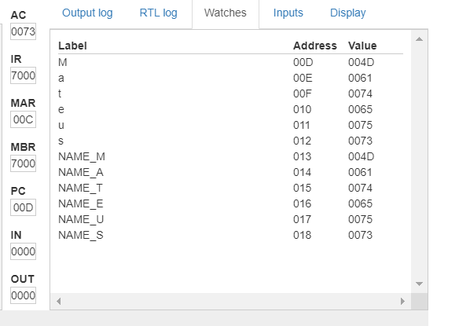

## Explicação do Programa de MARIE.js

### Como funciona a alocação de memória Dinâmica p/ Armazenamento seu nome.


```sh
ORG 000 /Inicia o Programa no endereço 000

load M
Store NAME_M
Load a
Store NAME_A
load t
Store NAME_T
load e
Store NAME_E
load u
Store NAME_U
Load s
Store NAME_S

Halt /Termina a Execução

//Tabela ASCII
M, HEX 4D
a, HEX 61
t, HEX 74
e, HEX 65
u, HEX 75
s, HEX 73

//Reserva o espaço para o nome 'Mateus'
NAME_M, HEX 0
NAME_A, HEX 0
NAME_T, HEX 0
NAME_E, HEX 0
NAME_U, HEX 0
NAME_S, HEX 0
```

#### O código reserva espaço na memória para armazenar o nome "Mateus". Onde cada variável (NAME_M, NAME_A, NAME_T, NAME_E, NAME_U, NAME_S) onde cada variável é uma posição de memória que será usada para armazenar um caractere do nome. E todas essas posições de memória são inicializadas com o valor hexadecimal 0

### Resultado



#### O quadro amararelo representa a Unidade de Controle, que mostra o estado atual do ciclo de instrução.

#### O quadro verde representa a Memória, durante a execução do programa, o conteúdo da memória será exibido no quadrado verde. Isso inclui endereços de memória e dados armazenados.

#### O Quadrado Vermelho representa a Unidade Aritmética e Lógica (ALU). Mostra operações aritméticas e lógicas sendo realizadas, como adição, subtração, AND, OR.

#### AC (Accumulator): É um registrador de propósito geral usado para armazenar resultados intermediários de operações aritméticas e lógicas.

#### IR (Instruction Register): Armazena a instrução atual que está sendo executada pela CPU.

#### MAR (Memory Address Register): Mantém o endereço de memória atualmente acessado ou o endereço da próxima instrução a ser buscada.

#### MBR (Memory Buffer Register): Usado para armazenar temporariamente dados lidos da memória ou dados que serão escritos na memória.

#### Refenrete a print mostrada apresenta uma tabela que mostra o endereço de memória (em hexadecimal) associado a cada caractere e variável no programa.

